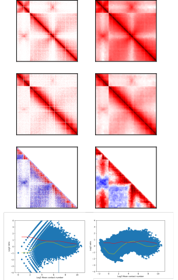

**Application Notes**
=====================

Binnagio del serpentino: a flexible 2D distribution-aware matrix binning method for differential Hi-C analysis 
========================================================================

Vittore Scolari\*^1^, Lyam Baudry\*^1^, Julien Mozziconacci^3^, Romain Koszul ^1,2^\*

^1^Institut Pasteur, Department Genomes and Genetics, Groupe Régulation
Spatiale des Génomes, 75015 Paris, France, 

^2^CNRS, UMR 3525, 75015
Paris, France, 

^3^Sorbonne Universités, UPMC Univ Paris 06, UMR 7600
LPTMC, Paris, France

\* To whom correspondence should be addressed. Corresponding authors.

E-mail: romain.koszul@pasteur.fr (R.K.), vittore.scolari@pasteur.fr
(V.S.)

**Abstract**

**Summary:** Differential analysis in the context of Hi-C data has been
a long-standing issue for various subsequent biological interpretations.
Hi-C maps are the result of genome-wide mapping of high-throughput
sequences onto loci pairs, and the contact frequencies may span several
orders of magnitude. This complexity makes it challenging to exactly
reproduce contact maps under identical biological conditions. This
translates into low signal-to-noise ratios in regions where genome data
is poorly covered or absent. As such, quantitatively comparing contact
maps in the majority of such regions can be difficult or impossible.
Various tools using increasingly complex and hard-to-scale methods have
been made to tackle this issue, with no clear consensus on the most
suitable ones. Binning has been the traditional go-to solution, with the
caveat that genome resolution is generally decreased, regardless of the
information content found between the relevant loci pairs. Here, we
present a flexible procedure taking into account the contacts in each
region of a contact map. Binning is performed only where necessary on
noisy regions, preserving informative ones and minimizing contact signal
entropy. This results in high-quality, low-noise contact maps that can
be conveniently visualized for rigorous comparative analyses.

**Availability and implementation**: The binning was implemented in
Python with extensive use of the numpy and matplotlib libraries for
computation and visualization respectively. The source code is available
at
[https://github.com/koszullab/serpentine](https://github.com/koszullab/serpentine).

**Contact** : romain.koszul@pasteur.fr or vittore.scolari@pasteur.fr

**Introduction**
================

Chromosomal conformation capture (3C)-based experiments provide a
quantitative way to observe the spatial proximity of DNA segments
(Dekker el *al*., 2002). Next-generation sequencing derivatives extended
the application of this approach to entire genome (for instance, Hi-C;
(Lieberman-Aiden el *al*., 2009). In these genomic approaches, raw
sequencing data are processed and interpreted through computational
analyses, in order to generate a genome-wide contact map (or matrix).
Downstream analysis include contact map normalization (Imakaev el *al*.,
2012; Cournac el *al*., 2012), contact
quantification, and three-dimensional representation (3D; Lesne el *al*.,
2014). Cumulatively, all
these processing steps combined with the diversity of experimental
parameters are liable to influence the data analysis in slight yet not
reproducible ways. While this does not affect global data analysis where
robust trends are not altered by noise, the quality of small-scale and
local comparisons suffers in poorly-covered regions. This makes contact
map comparison and differential analyses unusually difficult to
investigate other than qualitatively. The recent popularity of 3C assays
have prompted the development of a variety of tools designed to tackle
issues that arise when performing matrix comparison, such as diffHiC or
HiCcompare. These packages operate as joint normalization tools,
however, and may conflict with other normalization packages commonly
used by the Hi-C community, e.g. by using the Sequential Component
Normalization (SCN) when Iterative Correction and Eigenvector
decomposition (ICE) is more suitable to the use case at hand. Other
approaches typically try to perform pixel binning (also known as
sum-pooling, or subsampling) to increase the signal-to-noise ratio in
regions with few or no contacts, but they fail to take into account
contact-rich regions such as what may be found at small genome distance
scales, e.g. topologically associated domains (TADs).

In a recent work (Muller el *al*., 2018), we have shown that the optimal
resolution of a Hi-C experiment can only be defined for a given genomic
distance *s* and a given coverage. This observation implies that contact
differential analysis in HiC may only yield significant results for
genomic distances smaller than the one defined by the coverage. In order
to tackle the absence of an optimal resolution, we present here a
normalization-free and flexible method for strategically binning only
low-covered regions whilst preserving high contact ones. The procedure
makes no prior assumption about the contact distribution and does not
alter it other than locally. It is largely parameter-light, only
requiring a single contact threshold beyond which bins should not
aggregate further. This parameter can be chosen according to the data
and/or biological replicates. For matrix comparison purposes, the
procedure can be applied jointly to two matrices. We apply this method
to low-resolution, noisy datasets in order to show patterns can be
robustly measured and comparisons performed. We show noticeable
improvements in the quality and level of noise in the log-ratio of these
contact maps, opening new perspectives for in-depth differential
analysis when addressing more typical real-world data. In order to
validate our binning method, we show by means of an MD plot that the
noisy, low-information events are by and large removed from the contact
distribution when they would be otherwise preserved by traditional
binning methods.

**Materials and Methods**
=========================

**Serpentine binning**: The algorithm for serpentine binning is shown in
Figure 1A. It requires an input threshold m and a contact map M.
Briefly, for all pixels in M, that many sets of pixels (so-called
‘serpentines’) are initialized and set equal to the pixel singletons
themselves. Then each serpentine suitable for merging is merged with
another suitable neighboring serpentine chosen at random. A neighboring
serpentine is said to be suitable for merging if the average value of
its constituent pixels is lower than m. Two serpentines are said to be
neighbors if there is at least one pair of adjacent pixels that belong
to one and the other serpentine, respectively. Once all serpentines have
been sequentially iterated over this way, the process begins anew until
the total number of serpentines remains constant across two iterations,
indicating that the global serpentine structure cannot evolve further.
The resulting matrix is then binned serpentine-wise, i.e. each pixel
value is replaced with the average value of the final serpentine it
belongs to. The whole algorithm is iterated independently over N (where
N &gt; 4) times to ensure that serpentines are not biased toward a
specific 2D direction. The final binned matrix is the average of all
such binning iterations.

**Joint binning and comparison**: The above procedure can be adapted to
any number of matrices by keeping the serpentine structure synchronized
among all matrices. The ‘suitable for merging’ criterion must then apply
to all matrices being binned this way. If it is found to be too strict
and conservative, an additional parameter acting as a secondary
threshold t can be provided whereby merging is triggered anyway if a
serpentine in any of the matrices is below t on average. The secondary
threshold should be in practice much lower than the primary one in order
to avoid over-binning in potentially contact-rich regions. When
comparing two matrices, serpentines are computed over both, and the log
ratio of both matrices is binned this way. This provides an easier and
more convenient way of visualizing pattern differences.

**Parameters optimization:** In the absence of biological replicates,
users can use MDplots to choose an appropriate value for the threshold
in order to have a uniform noise-to-signal ratio that does not depend on
signal intensity. This choice is justified by the fact that the
divergence of the MDplots at low coverage is largely driven by random
sampling rather than biological variance. When biological replicates are
available, the coverage threshold under which the effects of sampling
becomes predominant over technical and biological variance can be
otherwise estimated.

**Application**: We applied our binning procedure to two noisy datasets
generated from a Hi-C library of *Saccharomyces cerevisiae* initially
binned at 5kbp (Figure 1B), hoping to capture two precise contact events
at short scales that would prove significant. The log-ratio of the raw
contact maps shows significant noise and local variance across regions
with little to no distinct emerging pattern. Although the
signal-to-noise ratio improves somewhat globally when performing
traditional binning, short-scale events are drowned out in the rest of
the signal. On the other hand, distribution-aware binning smoothens out
low-covered regions, making it clear that differences between datasets
in these areas are not significant, while strong short-scale patterns
remain visible. The evolution of matrices before and after binning can
be seen in Figure 1.

**Validation metrics**: In order to validate our binning procedure and
visualize the evolution of contact distribution differences, we drew MD
plots for the log-ratios of both datasets vs. the mean contacts in the
dataset. Both the raw datasets and the traditionally binned datasets are
characterized by the presence of spurious contacts on the tail-end of
the distribution that distort its global shape. These stem from very
low-covered regions whose noise results in variance spikes in the
log-ratio matrix. When applying serpentine binning, the signal variance
is reduced across these regions.

**Using serpentine binning**
============================

Our implementation is built on the numpy and matplotlib Python modules
and provides several ways to test and apply serpentine binning to a
variety of use cases. Matrices can be generated on the fly to test the
effects of parameter tuning on the resulting matrices and their
log-ratios. It can be also applied to a single matrix for efficient
binning and convenient visualization, or two matrices for joint binning
and comparison. In addition, we demonstrate its effects and utility on
example datasets in a notebook available on the implementation’s
repository.

**Acknowledgments and Funding**

This research was supported by funding to R.K. from the European
Research Council under the 7th Framework Program (FP7/2007-2013) / ERC
grant agreement 260822 and from Agence Nationale de la Recherche
(ANR-13-BSV6-0012-02).

*Conflict of interest*: none declared.

**References**
==============

\thebibliography

Cournac,A. *el *al*.* (2012) Normalization of a chromosomal contact map.
*BMC Genomics*, **13**, 436.

Dekker,J. *el *al*.* (2002) Capturing chromosome conformation. *Science*,
**295**, 1306–1311.

Hagberg,A.A. *el *al*.* (2008) Exploring Network Structure, Dynamics, and
Function using NetworkX. *Proc. 7th Python Sci. Conf. SciPy 2008*, G
Varoquaux, T Vaught, J Millman (Eds.), 11–15.

Imakaev,M. *el *al*.* (2012) Iterative correction of Hi-C data reveals
hallmarks of chromosome organization. *Nat. Methods*, **9**, 999–1003.

Jones,E. *el *al*.* (2001) {SciPy}: Open source scientific tools for
{Python}.

Langmead,B. and Salzberg,S.L. (2012) Fast gapped-read alignment with
Bowtie 2. *Nat. Methods*, **9**, 357–359.

Lesne,A. *el *al*.* (2014) 3D genome reconstruction from chromosomal
contacts. *Nat. Methods*, **11**, 1141–1143.

Lieberman-Aiden,E. *el *al*.* (2009) Comprehensive mapping of long-range
interactions reveals folding principles of the human genome. *Science*,
**326**, 289–293.

Li,W. *el *al*.* (2015) Hi-Corrector: a fast, scalable and
memory-efficient package for normalizing large-scale Hi-C data.
*Bioinforma. Oxf. Engl.*, **31**, 960–962.

Marbouty,M. *el *al*.* (2014) Metagenomic chromosome conformation capture
(meta3C) unveils the diversity of chromosome organization in
microorganisms. *eLife*, **3**, e03318.

Marie-Nelly,H. *el *al*.* (2014) High-quality genome (re)assembly using
chromosomal contact data. *Nat. Commun.*, **5**.

Muller, H el *al* (2018)

**Figures Legends**

Figure 1. Overview of the effects of serpentine binning: (**A**) First
dataset, (a) before and (b) after binning, (**B**) Second dataset, (a)
before and (b) after binning, (C) Log-ratio of both datasets (a) before
and (b) after binning, and (D) MD-plot of log-ratio vs mean contacts (a)
before and (b) after binning.

